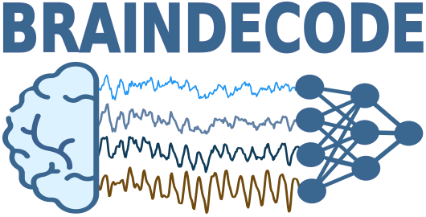

:html_theme.sidebar_secondary.remove:

.. title:: Braindecode

.. The page title must be in rST for it to show in next/prev page buttons.
   Therefore we add a special style rule to only this page that hides h1 tags

.. raw:: html

    

Braindecode Homepage
====================

.. LOGO

.. rst-class:: h4 text-center font-weight-light my-4 lead-intro

   Braindecode is an open-source Python toolbox for decoding raw electrophysiological brain
   data with deep learning models. It includes dataset fetchers, data preprocessing and
   visualization tools, as well as implementations of several deep learning
   architectures and data augmentations for analysis of EEG, ECoG and MEG.

.. rst-class:: h4 text-center font-weight-light my-4 lead-intro

   For neuroscientists who want to work with deep learning and
   deep learning researchers who want to work with neurophysiological data.

.. rst-class:: feature-anchor-nav text-center my-4

   `Models <#models-grid>`_ · `Datasets <#datasets-area>`_ · `Preprocessing <#preprocessing-tools>`_ · `Tutorials <#tutorials-ribbon>`_

.. _feature-highlights:

.. rst-class:: feature-section feature-section--hero

   .. container:: feature-hero__panel sd-shadow-sm sd-rounded-3

      .. grid:: 1 2 4
         :gutter: 1.2
         :class-container: feature-grid

         .. grid-item-card::
            :link: #models-grid
            :class-card: sd-card sd-rounded-3 h-100 feature-highlight-card feature-highlight-card--glass

            .. rst-class:: feature-highlight-card__icon

               ▤

            .. rst-class:: feature-highlight-card__title

               Models, ready to fine-tune

            .. rst-class:: feature-highlight-card__copy

               Curated architectures for motor imagery, sleep staging, and cross-dataset transfer—direct from the models gallery.

            .. rst-class:: feature-highlight-card__links

               :badge:`Deep4 <primary>` :badge:`EEGNet v4 <secondary>` :badge:`ShallowFBCSPNet <primary>`

         .. grid-item-card::
            :link: #datasets-area
            :class-card: sd-card sd-rounded-3 h-100 feature-highlight-card feature-highlight-card--glass

            .. rst-class:: feature-highlight-card__icon

               ⧉

            .. rst-class:: feature-highlight-card__title

               Datasets with MOABB built-in

            .. rst-class:: feature-highlight-card__copy

               Benchmark-ready downloads, cached metadata, and dashboards to triage EEG, ECoG, and MEG experiments faster.

            .. rst-class:: feature-highlight-card__links

               :badge:`MOABB <primary>` :badge:`EEGDash <secondary>` :badge:`Builders <primary>`

         .. grid-item-card::
            :link: #preprocessing-tools
            :class-card: sd-card sd-rounded-3 h-100 feature-highlight-card feature-highlight-card--glass

            .. rst-class:: feature-highlight-card__icon

               ⚙

            .. rst-class:: feature-highlight-card__title

               Preprocess with MNE-native steps

            .. rst-class:: feature-highlight-card__copy

               EEGPrep-style cleaning, notch and band-pass utilities, and window builders that keep Raw and Epochs metadata intact.

            .. rst-class:: feature-highlight-card__links

               :badge:`EEGPrep <primary>` :badge:`Filtering <secondary>` :badge:`Windowing <primary>`

         .. grid-item-card::
            :link: #tutorials-ribbon
            :class-card: sd-card sd-rounded-3 h-100 feature-highlight-card feature-highlight-card--glass

            .. rst-class:: feature-highlight-card__icon

               ▶

            .. rst-class:: feature-highlight-card__title

               Tutorials that ship pipelines

            .. rst-class:: feature-highlight-card__copy

               Walk-throughs that combine datasets, preprocessing, augmentation, and training recipes you can copy-paste.

            .. rst-class:: feature-highlight-card__links

               :badge:`Motor imagery <primary>` :badge:`Sleep staging <secondary>` :badge:`Benchmarks <primary>`

.. _models-grid:

Models
------

.. rst-class:: feature-section__subtitle text-center

   Browse ready-to-train architectures with capability badges and direct entry to the models gallery.

.. rst-class:: feature-section__meta text-center

   :btn-link-primary:`Open models gallery <models/models>` :btn-link-secondary:`See API <api.html#models>`

.. grid:: 1 2 4
   :gutter: 1.2
   :class-container: feature-grid

   .. grid-item-card:: Deep4
      :link: models/models
      :class-card: sd-card sd-shadow-sm sd-rounded-2 h-100 feature-card feature-card--panel

      .. rst-class:: feature-card__eyebrow

         Sensorimotor decoding

      .. rst-class:: feature-card__meta

         :badge:`BCI <primary>` :badge:`ConvNet <secondary>`

      Proven baseline for motor imagery and mu/beta rhythms with interpretable spatial filters and strong MOABB baselines.

   .. grid-item-card:: ShallowFBCSPNet
      :link: models/models
      :class-card: sd-card sd-shadow-sm sd-rounded-2 h-100 feature-card feature-card--panel

      .. rst-class:: feature-card__eyebrow

         Filter-bank precision

      .. rst-class:: feature-card__meta

         :badge:`Bandpower <primary>` :badge:`Lightweight <secondary>`

      Filter-bank design optimized for lightning-fast benchmarking, latency-sensitive feedback, and spectral interpretability.

   .. grid-item-card:: EEGNet v4
      :link: models/models
      :class-card: sd-card sd-shadow-sm sd-rounded-2 h-100 feature-card feature-card--panel

      .. rst-class:: feature-card__eyebrow

         Portable efficiency

      .. rst-class:: feature-card__meta

         :badge:`Compact <primary>` :badge:`Transfer learning <secondary>`

      Depthwise-separable convolutions built for cross-dataset transfer, on-device inference, and rapid prototyping.

   .. grid-item-card:: Sleep Stager (U-Time)
      :link: models/models
      :class-card: sd-card sd-shadow-sm sd-rounded-2 h-100 feature-card feature-card--panel

      .. rst-class:: feature-card__eyebrow

         Clinical context

      .. rst-class:: feature-card__meta

         :badge:`Sleep <primary>` :badge:`Sequence aware <secondary>`

      Temporal context modeling tuned for overnight recordings, hypnogram export, and clinical-grade sleep-stage scoring.

.. _datasets-area:

Datasets
--------

.. rst-class:: feature-section__subtitle text-center

   Pull curated EEG, ECoG, and MEG datasets with reproducible pipelines, dashboards, and cache-aware loaders.

.. rst-class:: feature-section__meta text-center

   :btn-link-primary:`MOABB integration <api.html#braindecode.datasets.MOABBDataset>` :btn-link-secondary:`EEGDash <https://neurotechx.github.io/eegdash/>`

.. grid:: 1 2 3
   :gutter: 1.2
   :class-container: feature-grid

   .. grid-item-card:: MOABB-first downloads
      :link: api.html#braindecode.datasets.MOABBDataset
      :class-card: sd-card sd-shadow-sm sd-rounded-2 h-100 feature-card feature-card--panel

      .. rst-class:: feature-card__eyebrow

         Benchmark pipelines

      .. rst-class:: feature-card__meta

         :badge:`Benchmark-ready <primary>` :badge:`Caching <secondary>`

      Load 20+ paradigms through :class:`braindecode.datasets.MOABBDataset` with automatic caching, subject/session metadata, and reproducible MOABB splits.

   .. grid-item-card:: EEGDash summaries
      :link: https://neurotechx.github.io/eegdash/
      :class-card: sd-card sd-shadow-sm sd-rounded-2 h-100 feature-card feature-card--panel

      .. rst-class:: feature-card__eyebrow

         Visual QA

      .. rst-class:: feature-card__meta

         :badge:`Visualization <primary>` :badge:`Quality checks <secondary>`

      Explore dashboards of recordings, annotations, and channel health to triage datasets before committing compute.

   .. grid-item-card:: Dataset builders
      :link: api.html#dataset-builders-functions
      :class-card: sd-card sd-shadow-sm sd-rounded-2 h-100 feature-card feature-card--panel

      .. rst-class:: feature-card__eyebrow

         Ready for training

      .. rst-class:: feature-card__meta

         :badge:`Raw to windows <primary>` :badge:`MNE-friendly <secondary>`

      Turn Raw, Epochs, or NumPy arrays into :class:`braindecode.datasets.BaseConcatDataset` objects, preserving description metadata for downstream splits.

.. _preprocessing-tools:

Preprocessing
-------------

.. rst-class:: feature-section__subtitle text-center

   Clean, window, and standardize with built-in pipelines powered by MNE utilities.

.. rst-class:: feature-section__meta text-center

   :btn-link-primary:`EEGPrep API <api.html#braindecode.preprocessing.EEGPrep>` :btn-link-secondary:`Signal processing <api.html#signal-processing>`

.. grid:: 1 2 3
   :gutter: 1.2
   :class-container: feature-grid

   .. grid-item-card:: EEGPrep pipeline
      :link: api.html#braindecode.preprocessing.EEGPrep
      :class-card: sd-card sd-shadow-sm sd-rounded-2 h-100 feature-card feature-card--panel

      .. rst-class:: feature-card__eyebrow

         Automated cleanup

      .. rst-class:: feature-card__meta

         :badge:`Artifact removal <primary>` :badge:`Automated <secondary>`

      Run channel checks, detrending, burst and drift removal, re-referencing, and bad-channel interpolation with sensible defaults inspired by EEGPrep.

   .. grid-item-card:: MNE-powered helpers
      :link: api.html#signal-processing
      :class-card: sd-card sd-shadow-sm sd-rounded-2 h-100 feature-card feature-card--panel

      .. rst-class:: feature-card__eyebrow

         Signal processing

      .. rst-class:: feature-card__meta

         :badge:`Filtering <primary>` :badge:`Hilbert <secondary>`

      Apply :class:`~braindecode.preprocessing.Filter`, :class:`~braindecode.preprocessing.NotchFilter`, and analytic signals via :class:`~braindecode.preprocessing.ApplyHilbert` using familiar MNE primitives.

   .. grid-item-card:: Windowing utilities
      :link: api.html#core-functions
      :class-card: sd-card sd-shadow-sm sd-rounded-2 h-100 feature-card feature-card--panel

      .. rst-class:: feature-card__eyebrow

         Ready-made splits

      .. rst-class:: feature-card__meta

         :badge:`Trials <primary>` :badge:`Continuous <secondary>`

      Build trials with :func:`~braindecode.preprocessing.create_windows_from_events` or sliding segments with :func:`~braindecode.preprocessing.create_fixed_length_windows`, preserving metadata across windows.

.. _tutorials-ribbon:

Tutorials
---------

.. rst-class:: feature-section__subtitle text-center

   Start from curated walkthroughs that combine datasets, preprocessing, and training recipes.

.. rst-class:: feature-section__meta text-center

   :btn-link-primary:`View all tutorials <auto_examples/index.html>` :btn-link-secondary:`Install & setup <install/install.html>`

.. rst-class:: horizontal-scroll-container

   .. grid:: 1 2 4
      :gutter: 1.2
      :class-container: feature-grid

      .. grid-item-card:: BCIC IV 2a (trialwise)
         :link: auto_examples/model_building/plot_bcic_iv_2a_moabb_trial.html
         :class-card: sd-card sd-shadow-sm sd-rounded-2 h-100 feature-card feature-card--panel

         .. rst-class:: feature-card__eyebrow

            Motor imagery

         .. rst-class:: feature-card__meta

            :badge:`MOABB <primary>` :badge:`Deep4 <secondary>`

         Fetch, window, and train on motor imagery with reproducible metrics.

      .. grid-item-card:: Sleep staging with U-Time
         :link: auto_examples/applied_examples/plot_sleep_staging_usleep.html
         :class-card: sd-card sd-shadow-sm sd-rounded-2 h-100 feature-card feature-card--panel

         .. rst-class:: feature-card__eyebrow

            Overnight EEG

         .. rst-class:: feature-card__meta

            :badge:`Sleep <primary>` :badge:`Sequence <secondary>`

         Learn temporal context models and export predictions for hypnogram review.

      .. grid-item-card:: Lightning vs. pure PyTorch
         :link: auto_examples/model_building/plot_train_in_pure_pytorch_and_pytorch_lightning.html
         :class-card: sd-card sd-shadow-sm sd-rounded-2 h-100 feature-card feature-card--panel

         .. rst-class:: feature-card__eyebrow

            Training stacks

         .. rst-class:: feature-card__meta

            :badge:`Training loops <primary>` :badge:`Callbacks <secondary>`

         Compare minimal training scripts with richer logging and checkpointing workflows.

      .. grid-item-card:: MOABB benchmarks at scale
         :link: auto_examples/advanced_training/plot_moabb_benchmark.html
         :class-card: sd-card sd-shadow-sm sd-rounded-2 h-100 feature-card feature-card--panel

         .. rst-class:: feature-card__eyebrow

            Reproducible suites

         .. rst-class:: feature-card__meta

            :badge:`Benchmark <primary>` :badge:`Cross-session <secondary>`

         Run large suites with consistent preprocessing to stress-test model robustness.

.. frontpage gallery is added by a conditional in _templates/layout.html

.. toctree::
   :hidden:

   Install <install/install>
   Models <models/models>
   Cite <cite>
   Tutorial and Examples <auto_examples/index>
   API <api>
   Get help <help>
   What's new <whats_new>
